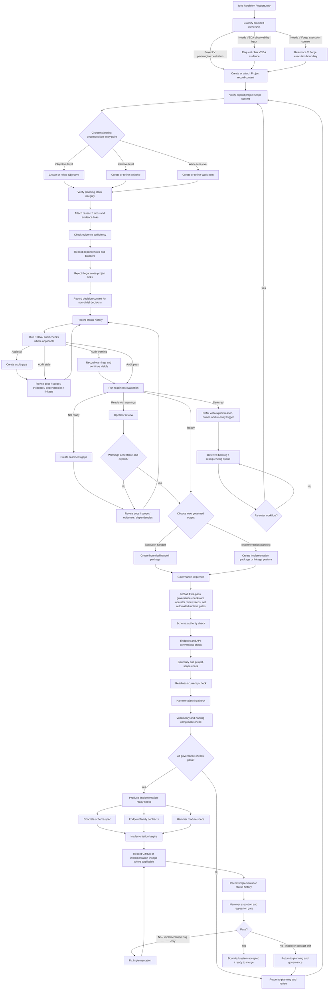

# Project V Operational Workflow

## Purpose

This document defines the intended operational workflow for Project V from idea intake through implementation-ready output.

It exists to answer:

```text
How should a new idea move through Project V from intake, classification, planning, readiness, governance, implementation, and hardening without boundary drift or multi-project failure?
```

---

## Mermaid Diagram



---

## Flow Notes

### 1. Intake, ownership, and scope come first

A new idea should not go straight into schema or endpoint work.
It must first be classified by bounded ownership and then anchored to explicit project scope.

### 2. Planning entry can start at different levels

The common decomposition path is Objective -> Initiative -> Work Item.

However, the operational workflow may begin at the objective, initiative, or work-item level depending on what is already known.
What matters is that the resulting planning stack is structurally valid before governance and implementation outputs are produced.

### 3. Verify planning stack integrity before moving on

`Verify planning stack integrity` means confirming that the current planning record has the right parent/child context, scope alignment, and required structural support for the chosen level of decomposition.

This step should not be treated as a vague normalization ritual.
It is a structural integrity check.

### 4. Research and evidence support planning

Project V may attach research and VEDA-informed evidence for planning purposes.
That does not make Project V the owner of observatory truth.

### 5. Evidence sufficiency should be checked before BYDA or readiness

Before BYDA or readiness runs, the workflow should verify that the current record has enough evidence, rationale, or supporting material to justify evaluation.

BYDA and readiness should not be the first place where the system discovers there is no basis for the claim.

### 6. Dependencies must remain project-safe

When dependencies and blockers are recorded, the workflow must reject illegal cross-project links unless a deliberately modeled exception exists later.

At 100+ projects, this cannot be left to assumption.

### 7. Decision recording is required for non-trivial decisions

`Record decision context for non-trivial decisions` means decisions that:

- change planning direction materially
- change readiness or gating posture materially
- create or approve a handoff
- change scope, priority, or sequencing materially
- alter interpretation of evidence in a meaningful way

This step should not be skipped casually.

### 8. Status history is a standing obligation

Meaningful workflow changes should leave recoverable status history.
This is especially important around readiness, handoffs, implementation start, implementation correction, and correction loops back to planning.

### 9. BYDA and audit placement must stay explicit

Where BYDA-style audit is applicable, audit should run before or alongside the readiness gate rather than being implied later.

BYDA behaves like a governed questioning layer tied to lifecycle stage, target entity, and expected evidence or artifacts.
It should ask what was checked, what failed, what became ambiguous, and whether confidence has gone stale.

Audit outputs may strengthen or invalidate readiness confidence, but they do not silently replace readiness records.

### 10. Audit gaps and readiness gaps are different

Audit gaps preserve audit failures, contradictions, ambiguity findings, and invalidation-related weaknesses.

Readiness gaps preserve readiness deficiencies.
They may relate to one another, but they should not be silently collapsed into one record type.

### 11. Readiness is a gate, not decoration

A work item, handoff package, or implementation package/linkage posture should not move forward until readiness is explicitly evaluated.

### 12. `ready_with_warnings` may proceed only under strict conditions

A `ready_with_warnings` result may move forward only when:

- the warnings are advisory rather than structurally blocking
- project scope and ownership remain clear
- the operator explicitly approves proceeding
- the unresolved warnings are still visible in the record

If warnings undermine readiness basis materially, the item should return to revision instead.

### 13. Deferred is not a graveyard

Deferred work must preserve:

- explicit reason
- owner
- re-entry trigger
- resequencing visibility

### 14. Handoff and implementation planning are different outputs

A bounded handoff package is not the same thing as an implementation package or implementation-linkage posture.
The workflow should keep those outputs distinct.

### 15. Governance checks are review-time steps, not automated runtime gates

**This is the most important constraint on the governance sequence.**

In the first pass, all six governance checks (schema authority, endpoint conventions, boundary/scope, readiness currency, hammer planning, vocabulary compliance) are **operator review steps**. They are not automated API-level gates that will reject a request at runtime.

The diagram node `All governance checks pass?` means: did a human or LLM-assisted operator verify all six conditions before producing implementation-ready specs? It is not a machine-enforced checkpoint.

This means:

- the governance sequence depends on operator discipline, not runtime enforcement
- the hammer suite is the closest thing to post-hoc automated verification
- if a specific check is later promoted into an automated gate, that promotion must be an explicit governed decision, not a silent implementation assumption

Governance checks should occur in a deliberate order so that scope, schema, contract, readiness, hammering, and naming are all reviewed before implementation begins.

### 16. Governance pass/fail must be explicit

`All governance checks pass?` means all of the following are true:

- the proposed schema shape conforms to schema authority
- the proposed endpoints conform to endpoint governance and API conventions
- project scope and system boundaries remain explicit and correct
- readiness is still current for the proposed output
- hammer planning exists for the affected capability
- naming and vocabulary remain compliant with the governed docs

If any one of these fails, the workflow returns to planning and revision.

### 17. Invalidation must be visible

A material rollback, superseding decision, material contract change, or implementation-linkage change may invalidate downstream audit or readiness confidence.

That invalidation must be explicit rather than assumed.

### 18. GitHub linkage belongs in implementation tracking

Where GitHub linkage is in scope, the implementation-tracking phase should be the place where repository, branch, PR, commit, or issue links become explicit bounded traceability records.

### 19. Implementation failure must distinguish bug vs drift

If hammer execution fails, Project V should distinguish:

- implementation defects that can be fixed locally
- model or contract drift that requires a return to planning and governance

### 20. Hammer validation closes the loop

A capability is not considered hardened merely because implementation exists.
It must survive hammer execution and regression checks.
